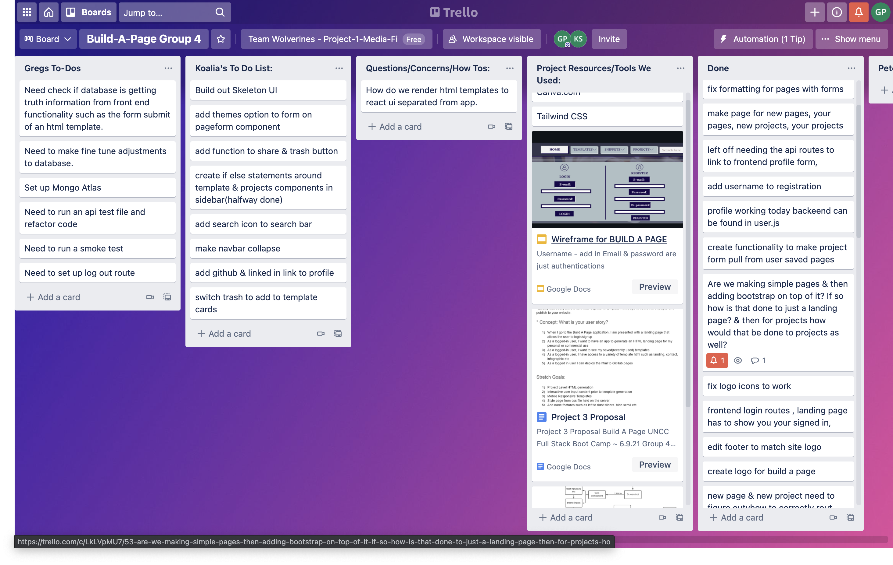

# Build-A-Page
## Links 
## [Repo](https://github.com/GregPetropoulos/Page-Builder) <br>
## [Heroku Deployment](https://buildapage.herokuapp.com/)
### License


## Description
Build A Page is an application where the user can quickly and easily build eye catching and responsive templates. The user can choose from a single html page or multiple pages to use for the user’s website.  Our future improvements imply the site’s ability to publish to Github Pages.

<!-- ## Pitch Presentation
[Presentaton](https://docs.google.com/presentation/d/e/2PACX-1vTbvUXWHj0b118pvrTLdYcDH5v9R5aH-YBT8gzzB6zgg_4vZkThLtKwukhsNDieRbndLPJaS9vMxpNZ/pub?start=false&loop=false&delayms=3000) -->


## User Story
AS a user I want to generate an HTML landing page for my personal or commercial use.<br>
WHEN I go to the Build A Page application, I am presented with a landing page that allows the user to login/signup.<br>
THEN as a logged-in user, I want to be able to create my own custom layout.<br>
WHEN I click on templates I am able to choose from different options from heading, custom color and images to build my page.<br>
SO when I have completed my desired layout I am able to view, download or delete my template.<br>

# Demo

### Login and Sign up Page

 
 
 ### Home Page


### Choose Your Template!


### Landing Page Template


### Landing Page Template 2


### User's Profile Information Page


### Stat Page (for user traffic)


## Concepts

## Table of Contents 

* [Links](#links)
* [License](#license)
* [Description](#description)
* [User Story](#user-story)
* [Demo](#demo)
* [Initial Concepts and WireFrames](#Concepts)
* [Technologies](#technologies)
* [Structure](#structure)
* [Project Management](#Agile)
* [Scripts](#scripts)
* [Packages](#packages)
* [Database](#database)
---
* [Features](#features)
* [Test](#test)
* [Credits](#credits)
* [How to Contribute](#how-to-contribute)
----
* [Code of Conduct](#code-of-conduct)

## Technologies

* React
* Javascript
* HTML5
* CSS3
* Express.js
* Node.js
* MongoDB
* Mongoose
* Heroku
* Github 
* MVC paradigm

    - ### Newer Tech Packages
        * Readable streams from npm library
        * TailwindUI for styling the app

## Structure
- Models Views Controllers (MVC) paradigm as part of the process to maintain architecture organization and code integrity. 
- The Views being the frontend folder typically the client folder for React.
- Used ```<AuthProvider/>``` to wrap the app to avoid prop drilling


## AGILE Project Management
 

## Database
The mongoose schema was used to access Mongo Atlas and work directly with the cloud hosting and the database while developing the application.
There are two Schemas:
  
   1. User.js for accessing all the users info such as email, username, pages, profile, password, avatar, and date.
   
   2. PageStats for page visits

## Features

## Test
Smoke test

## Credits

## How to contribute


## Scripts
In order to run nodemon and client side with React App we utilized concurrently to expedite the development process.
    
``` "start": "node server.js"```

```"dev": "concurrently \"nodemon --ignore ./frontend/ server.js\" \"cd frontend && npm start\""```

``` "build": "cd frontend && npm install && npm run build"```
    ```"heroku-postbuild": "npm run build" ```

## Packages

installed packages on server side
```npm i ```

```npm i morgan ``` 

```npm i express``` 

```npm i mongoose```

```npm i nodemon```

```npm install eslint --save-dev```

```npm i axios```

```npm i bcrypt```

```npm i normalize```

```npm i gravatar```

```npm i nedux```

```npm i socket```

## Links
[Repository](https://github.com/GregPetropoulos/Page-Builder) <br>
[Heroku Deployment](https://buildapage.herokuapp.com/)

## Contributor Covenant Code of Conduct

### Our Pledge

We as members, contributors, and leaders pledge to make participation in our
community a harassment-free experience for everyone, regardless of age, body
size, visible or invisible disability, ethnicity, sex characteristics, gender
identity and expression, level of experience, education, socio-economic status,
nationality, personal appearance, race, caste, color, religion, or sexual identity
and orientation.

We pledge to act and interact in ways that contribute to an open, welcoming,
diverse, inclusive, and healthy community.

## Our Standards

Examples of behavior that contributes to a positive environment for our
community include:

- Demonstrating empathy and kindness toward other people
- Being respectful of differing opinions, viewpoints, and experiences
- Giving and gracefully accepting constructive feedback
- Accepting responsibility and apologizing to those affected by our mistakes,
  and learning from the experience
- Focusing on what is best not just for us as individuals, but for the
  overall community

Examples of unacceptable behavior include:

- The use of sexualized language or imagery, and sexual attention or
  advances of any kind
- Trolling, insulting or derogatory comments, and personal or political attacks
- Public or private harassment
- Publishing others' private information, such as a physical or email
  address, without their explicit permission
- Other conduct which could reasonably be considered inappropriate in a
  professional setting

## Enforcement Responsibilities

Community leaders are responsible for clarifying and enforcing our standards of
acceptable behavior and will take appropriate and fair corrective action in
response to any behavior that they deem inappropriate, threatening, offensive,
or harmful.

Community leaders have the right and responsibility to remove, edit, or reject
comments, commits, code, wiki edits, issues, and other contributions that are
not aligned to this Code of Conduct, and will communicate reasons for moderation
decisions when appropriate.

## Scope

This Code of Conduct applies within all community spaces, and also applies when
an individual is officially representing the community in public spaces.
Examples of representing our community include using an official e-mail address,
posting via an official social media account, or acting as an appointed
representative at an online or offline event.

## Enforcement

Instances of abusive, harassing, or otherwise unacceptable behavior may be
reported to the community leaders responsible for enforcement at
[](code_of_conduct.md).
All complaints will be reviewed and investigated promptly and fairly.

All community leaders are obligated to respect the privacy and security of the
reporter of any incident.

## Enforcement Guidelines

Community leaders will follow these Community Impact Guidelines in determining
the consequences for any action they deem in violation of this Code of Conduct:

### 1. Correction

**Community Impact**: Use of inappropriate language or other behavior deemed
unprofessional or unwelcome in the community.

**Consequence**: A private, written warning from community leaders, providing
clarity around the nature of the violation and an explanation of why the
behavior was inappropriate. A public apology may be requested.

### 2. Warning

**Community Impact**: A violation through a single incident or series
of actions.

**Consequence**: A warning with consequences for continued behavior. No
interaction with the people involved, including unsolicited interaction with
those enforcing the Code of Conduct, for a specified period of time. This
includes avoiding interactions in community spaces as well as external channels
like social media. Violating these terms may lead to a temporary or
permanent ban.

### 3. Temporary Ban

**Community Impact**: A serious violation of community standards, including
sustained inappropriate behavior.

**Consequence**: A temporary ban from any sort of interaction or public
communication with the community for a specified period of time. No public or
private interaction with the people involved, including unsolicited interaction
with those enforcing the Code of Conduct, is allowed during this period.
Violating these terms may lead to a permanent ban.

### 4. Permanent Ban

**Community Impact**: Demonstrating a pattern of violation of community
standards, including sustained inappropriate behavior, harassment of an
individual, or aggression toward or disparagement of classes of individuals.

**Consequence**: A permanent ban from any sort of public interaction within
the community.

## Attribution

This Code of Conduct is adapted from the [Contributor Covenant][homepage],
version 2.0, available at
[https://www.contributor-covenant.org/version/2/0/code_of_conduct.html][v2.0].

Community Impact Guidelines were inspired by
[Mozilla's code of conduct enforcement ladder][mozilla coc].

For answers to common questions about this code of conduct, see the FAQ at
[https://www.contributor-covenant.org/faq][faq]. Translations are available
at [https://www.contributor-covenant.org/translations][translations].

[homepage]: https://www.contributor-covenant.org
[v2.0]: https://www.contributor-covenant.org/version/2/0/code_of_conduct.html
[mozilla coc]: https://github.com/mozilla/diversity
[faq]: https://www.contributor-covenant.org/faq
[translations]: https://www.contributor-covenant.org/translations

## License


Copyright (c) [2021] [Greg Petropoulos]

Permission is hereby granted, free of charge, to any person obtaining a copy
of this software and associated documentation files (the "Software"), to deal
in the Software without restriction, including without limitation the rights
to use, copy, modify, merge, publish, distribute, sublicense, and/or sell
copies of the Software, and to permit persons to whom the Software is
furnished to do so, subject to the following conditions:

The above copyright notice and this permission notice shall be included in all
copies or substantial portions of the Software.

THE SOFTWARE IS PROVIDED "AS IS", WITHOUT WARRANTY OF ANY KIND, EXPRESS OR
IMPLIED, INCLUDING BUT NOT LIMITED TO THE WARRANTIES OF MERCHANTABILITY,
FITNESS FOR A PARTICULAR PURPOSE AND NONINFRINGEMENT. IN NO EVENT SHALL THE
AUTHORS OR COPYRIGHT HOLDERS BE LIABLE FOR ANY CLAIM, DAMAGES OR OTHER
LIABILITY, WHETHER IN AN ACTION OF CONTRACT, TORT OR OTHERWISE, ARISING FROM,
OUT OF OR IN CONNECTION WITH THE SOFTWARE OR THE USE OR OTHER DEALINGS IN THE
SOFTWARE.

## Questions

### Contact:

Github: [https://github.com/gregpetropoulos](https://github.com/gregpetropoulos)

Email: <gregpetropoulos@yahoo.com>
